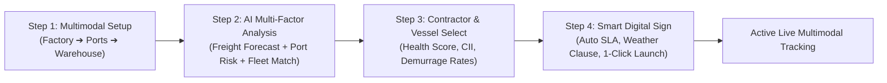

# End-to-End Multimodal Supply Chain Architecture & 4-Profile Plan

## Overview
Transform ASTRA into a streamlined, high-impact **End-to-End Multimodal Maritime & Inland Logistics Platform** tailored for a winning SIH demonstration. 

The system links:
`Source Factory/Warehouse ➔ Inland Road/Rail ➔ Origin Port ➔ Ocean Transit (Vessels) ➔ Destination Port ➔ Last-Mile Road/Rail ➔ Destination Warehouse/Plant` across **4 synchronized stakeholder profiles**.

---

## 1. Role-Specific Views & Data Segregation (Judge Demo Strategy)

To answer: *"Step D sabko dikhega ya specific?"*

| Profile | Primary View / Dashboard | What They See in Live Tracking |
|---|---|---|
| 🏢 **Company (Shipper / Cargo Owner)** | **End-to-End Master View** | Full 5-Stage Multimodal Timeline (Warehouse ➔ Road ➔ Origin Port ➔ Sea ➔ Dest Port ➔ Road ➔ Factory), Total Cost & Demurrage Shield, Live ETA. |
| 🚢 **Ocean Contractor (Vessel Operator)** | **Fleet & Charter Desk** | Ocean Voyage Leg, AIS Coordinates, Vessel Health & Telematics (Engine/Hull), Digital Fixture Contracts. |
| 🚛 **Road Transporter (Fleet Partner)** *(NEW)* | **Inland Fleet Command** | First-Mile & Last-Mile Truck Dispatches, QR Gate Passes, Driver GPS, Port In-gate/Out-gate Queue sync. |
| ⚓ **Port Operator (Terminal Controller)** | **Berth & Queue Dispatcher** | Approaching Vessels, Berth Depth/LOA Allocation, Pre-positioned Cranes, **Dynamic Berth Re-scheduler (10-hr Delay Conflict Solver)**. |

> [!TIP]
> **Top Bar Instant Persona Switcher**: In the header, a sleek 1-click role switcher allows presenters/judges to jump between the 4 personas instantly without logging out, seeing how an action in one profile directly updates the others!

---

## 2. Streamlined Navigation (Zero Clutter / Minimal Sidebar)

Instead of 12 confusing standalone tabs, each profile has **only 2–3 hyper-relevant, high-value menu items**:

- **🏢 Company**:
  1. `📦 Multimodal Dashboard` (Overview of active shipments & live multimodal map)
  2. `➕ New Shipment Wizard` (Unified 4-step wizard: Setup ➔ AI Multi-Factor Analysis ➔ Contractor & Fleet Selection ➔ Digital Fixture Sign)
  3. `📜 Contract Fixtures & History` (Signed contracts, SLAs, cost breakdown)

- **🚢 Ocean Contractor**:
  1. `🚢 Fleet & Voyages Desk` (Active ships on water, ETA status)
  2. `🩺 Vessel Diagnostics & Health` (Engine efficiency, hull condition, CII rating)
  3. `📑 Charter Bookings & Fixtures` (Incoming signed requirements from companies)

- **🚛 Road Transporter** *(NEW)*:
  1. `🚛 Inland Fleet Dispatch` (First-mile & Last-mile truck allocations)
  2. `🎟️ Port Gate Passes & Schedule` (Synchronized time-slots for direct jetty loading)

- **⚓ Port Operator**:
  1. `⚓ Berth & Terminal Command` (Live vessel berths, crane allocations)
  2. `⚡ Dynamic Rescheduling (Conflict Solver)` (Intelligent delay handler)

---

## 3. The Unified "New Requirement" AI Flow (Company Profile)

The wizard combines all previous disparate screens into 4 clean, logical steps:

### AI Analysis Explained (Step 2 of Wizard)
- **Freight Rate Forecast**: Deep-learning forecast (Temporal Fusion) predicting 14-day spot price trend ($/ton) on selected ocean lane.
- **Port Waiting & Demurrage Risk**: ML regressor calculating expected anchorage queue (days/hours) and demurrage financial liability at destination port.
- **Multimodal Fleet Optimizer**: Calculates optimal mix of Vessel Class (Panamax / Supramax) + Number of Inland 40T Multi-Axle Trucks for lowest total landed cost.

---

## 4. The Killer Interactive Demo: 10-Hour Delay & Dynamic Berth Swap

An interactive simulation trigger demonstrates real-time interoperability:

1. **Trigger Monsoon Swell Delay**: On the voyage map, click *"Simulate 10h Ocean Delay"*.
2. **Vessel Status Changes**: Vessel ETA extends by +10 hours.
3. **Port Operator Dynamic Alert**: Port Operator receives a high-priority prompt:
   - *"MV Bengal Voyager delayed by 10 hrs. Berth #2 will be idle."*
   - *"Recommendation: Reassign Berth #2 to MV Coastal Pride (6-hour quick turnaround). Pre-position Mobile Harbor Crane #3."*
   - Port Operator clicks **"Approve Dynamic Reschedule"**.
4. **Road Transporter Synchronized**: Road trucks at destination port receive rescheduled gate-in slot, preventing road congestion outside port gates.
5. **Company Dashboard Updated**: Demurrage penalty reduced to $0 through proactive replanning!

---

## Proposed Changes

### 1. State Management & API
#### [MODIFY] [flow.jsx](file:///c:/Users/DELL/Downloads/astra_forecast_1.preview.emergentagent.com/astra-app/src/lib/flow.jsx)
- Support multimodal cargo legs (warehouse origins, inland trucks, port slots, ocean voyages).
- Support live interactive delay triggers and multi-role sync states.

#### [MODIFY] [auth.jsx](file:///c:/Users/DELL/Downloads/astra_forecast_1.preview.emergentagent.com/astra-app/src/lib/auth.jsx)
- Add the 4th role (`road_transporter` / `inland_logistics`) with pre-authenticated demo account.

### 2. Navigation & Layout
#### [MODIFY] [Sidebar.jsx](file:///c:/Users/DELL/Downloads/astra_forecast_1.preview.emergentagent.com/astra-app/src/components/Sidebar.jsx)
- Clean, minimal, role-specific navigation without redundant links.
#### [MODIFY] [Topbar.jsx](file:///c:/Users/DELL/Downloads/astra_forecast_1.preview.emergentagent.com/astra-app/src/components/Topbar.jsx)
- Add quick Role Switcher pills (`Company`, `Contractor`, `Road Transporter`, `Port Ops`) with active status indicator.
#### [MODIFY] [Login.jsx](file:///c:/Users/DELL/Downloads/astra_forecast_1.preview.emergentagent.com/astra-app/src/pages/Login.jsx)
- 4 clear preset login cards with distinct icons.

### 3. Core Pages & Workspaces
#### [MODIFY] [NewRequirement.jsx](file:///c:/Users/DELL/Downloads/astra_forecast_1.preview.emergentagent.com/astra-app/src/pages/NewRequirement.jsx)
- Multimodal route inputs (Source Warehouse/Factory ➔ Origin Port ➔ Dest Port ➔ Dest Plant).
- Integrated multi-tab AI Analysis (Freight + Port Risk + Fleet Allocation).
- Contractor selection with detailed specs and vessel health scores.
- Digital contract generator with 1-click execution.

#### [NEW] [RoadLogistics.jsx](file:///c:/Users/DELL/Downloads/astra_forecast_1.preview.emergentagent.com/astra-app/src/pages/RoadLogistics.jsx)
- Dedicated Road Transporter workspace for first-mile & last-mile fleet dispatch, QR gate passes, and port sync.

#### [MODIFY] [PortIntelligence.jsx](file:///c:/Users/DELL/Downloads/astra_forecast_1.preview.emergentagent.com/astra-app/src/pages/PortIntelligence.jsx)
- Dynamic Berth Re-allocation simulator with 1-click slot conflict resolution and crane dispatch.

#### [MODIFY] [Dashboard.jsx](file:///c:/Users/DELL/Downloads/astra_forecast_1.preview.emergentagent.com/astra-app/src/pages/Dashboard.jsx) & [VoyageTracking.jsx](file:///c:/Users/DELL/Downloads/astra_forecast_1.preview.emergentagent.com/astra-app/src/pages/VoyageTracking.jsx)
- Full 5-stage multimodal journey tracking bar.
- Interactive delay simulation controller.

---

## Verification Plan

### Manual Verification in Browser
1. **Role Switcher Test**: Toggle between Company, Contractor, Road Transporter, and Port Operator in topbar. Verify tailored navigation and workspace for each.
2. **New Shipment Wizard Flow**:
   - Fill in Factory-to-Plant multimodal requirement.
   - Inspect AI Multi-Factor Analysis (Freight trend, Port risk, Fleet optimizer).
   - Review contractor details & vessel health diagnostic card.
   - Digitally sign and launch shipment.
3. **Multimodal Tracking & Simulation**:
   - View the 5-stage progress (Factory ➔ Road ➔ Port ➔ Ocean ➔ Port ➔ Road ➔ Dest Plant).
   - Click "Simulate 10h Monsoon Delay".
   - Switch to Port Operator to see the real-time conflict alert & approve dynamic berth swap.
   - Switch to Road Transporter to verify gate-in reschedule.
